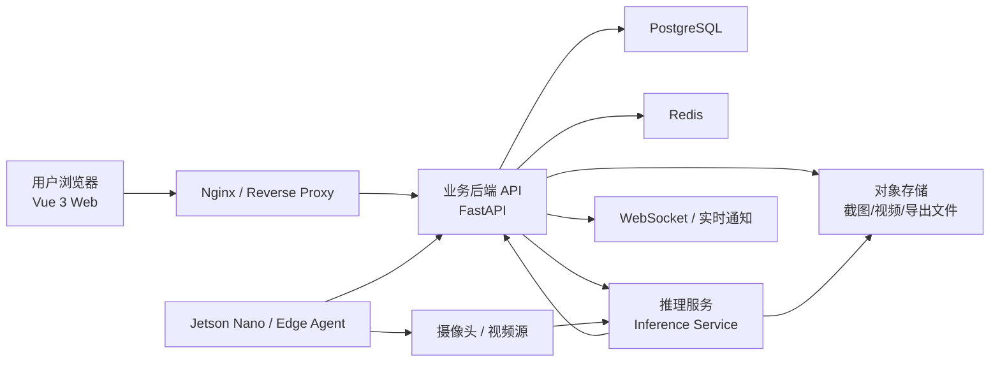
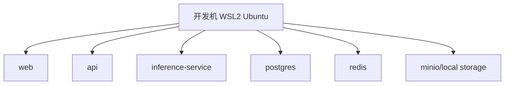
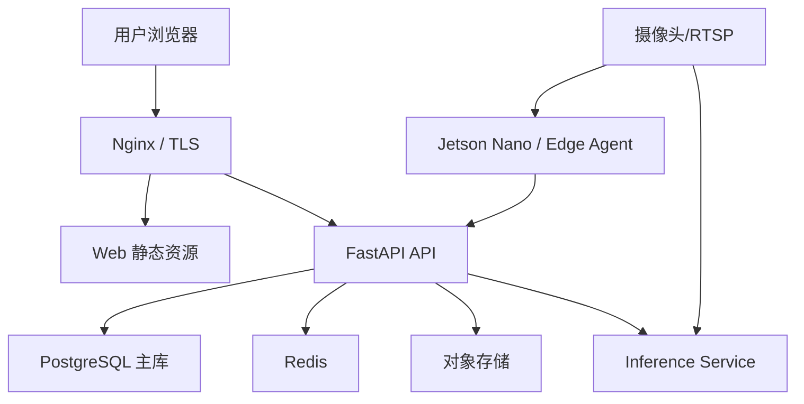
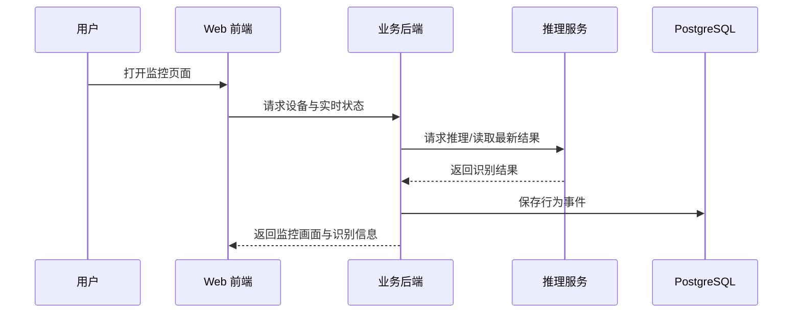
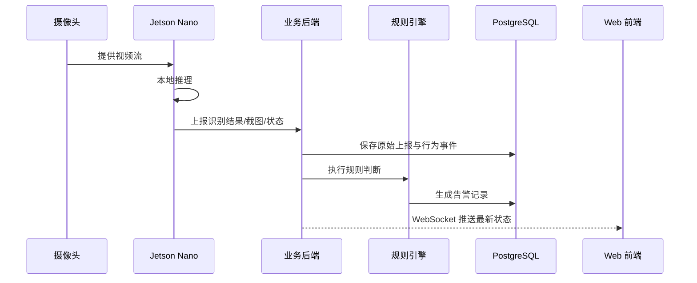
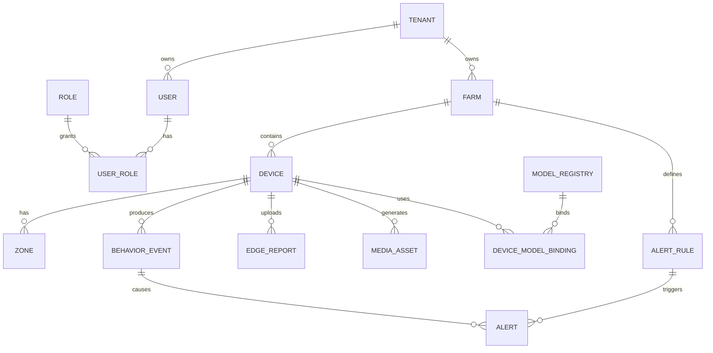

# 牛只智能监控平台系统架构设计文档

文档版本：`V1.0`  
文档日期：`2026-04-06`  
项目名称：`牛只智能监控平台`  
文档类型：`System Architecture Design Document`

## 1. 文档目的

本文档基于 [牛只智能监控平台_产品需求文档](C:/Users/Admin/Desktop/毕设/牛只智能监控平台_产品需求文档.md) 进行系统级设计，目标是将产品需求转化为可落地的技术实现方案，为后续开发、联调、部署、扩展和答辩展示提供统一依据。

本文档重点覆盖以下内容：

- 系统总体架构
- 项目目录结构
- 核心模块划分
- 数据模型设计
- 安全、性能与扩展性设计
- 部署方案
- 代码规范与工程规范建议

## 2. 项目背景与设计目标

平台面向农场主、养殖场管理人员和监控值班人员，围绕牛只行为监控展开，核心能力包括：

- 多摄像头接入与统一管理
- 基于 `YOLOv8 + KNN` 的牛只识别与基础行为判断
- 水池、栏位、采食区等关键区域标注
- 预设异常行为与用户自定义规则
- 告警中心、历史数据查询与可视化
- 预留模型可替换能力
- 预留 `Jetson Nano` 边缘部署与结果上报能力

系统设计目标如下：

1. 先实现一个结构清晰、可演示、可迭代的产品平台。
2. 保证当前技术水平下能够顺利实现，不被过度复杂的架构拖累。
3. 为后续模型替换、边缘部署、设备增加和租户扩展预留接口。
4. 满足正式发布产品所需的基础安全、性能和可运维要求。

## 3. 设计原则

### 3.1 总体原则

- 优先采用 `模块化单体`，避免过早引入微服务复杂度。
- 将 `Web 业务平台` 与 `AI 推理服务` 解耦。
- 将 `边缘设备上报` 作为标准输入源之一，而不是特殊逻辑。
- 保证平台对不同模型保持统一输入输出契约。
- 核心数据结构稳定，边缘结果、模型配置、规则参数允许适度灵活。

### 3.2 技术原则

- 前端采用 `Vue 3 + TypeScript`，适合后台管理型产品开发。
- 后端采用 `FastAPI`，便于复用 Python 生态与现有识别代码。
- 数据库采用 `PostgreSQL`，兼顾关系建模与 `jsonb` 扩展能力。
- 缓存与实时事件采用 `Redis`，降低热点查询和实时通知压力。
- 文件与媒体内容采用对象存储思路设计，避免数据库承载大文件。

### 3.3 工程原则

- 目录结构按业务域划分，而不是按技术层杂糅堆叠。
- 接口、数据模型、规则引擎、设备接入均采用可扩展设计。
- 所有关键逻辑必须可测试、可记录、可追踪。

## 4. 总体架构设计

本系统采用“前后端分离 + 模块化单体业务平台 + 独立推理服务 + 可选边缘设备接入”的架构模式。

### 4.1 总体架构图



### 4.2 架构说明

- `Web 前端` 负责用户交互、监控总览、设备管理、规则配置、告警中心与历史查询。
- `业务后端 API` 负责认证鉴权、核心业务逻辑、数据存储、规则计算、告警生成、设备管理、边缘上报接收。
- `推理服务` 负责执行 `YOLOv8 + KNN` 或后续其他模型的推理，不承担登录、权限、后台管理逻辑。
- `Jetson Nano / Edge Agent` 负责边缘侧视频采集、本地推理、结果上报与设备心跳。
- `PostgreSQL` 负责核心业务数据持久化。
- `Redis` 负责缓存、短期状态、实时事件和通知加速。
- `对象存储` 负责截图、视频片段、导出文件等媒体资产。

## 5. 部署拓扑设计

### 5.1 开发环境拓扑

开发环境建议在 `Windows + WSL2 Ubuntu + Docker Compose` 中运行。



特点：

- 所有服务可在一台开发机上运行。
- 便于学习完整产品开发流程。
- 降低环境复杂度，适合当前阶段。

### 5.2 生产环境拓扑



特点：

- Web 与 API 统一通过 Nginx 暴露。
- 推理服务可按算力条件独立扩容。
- 边缘设备可直接将识别结果上报至平台。
- 后续若设备规模扩大，可将推理、规则计算、消息处理进一步拆分。

## 6. 技术栈选型落地

### 6.1 前端

- `Vue 3`
- `TypeScript`
- `Vite`
- `Vue Router`
- `Pinia`
- `Element Plus`
- `ECharts`

适用原因：

- 适合管理后台类产品开发。
- 表单、表格、图表、权限页面开发效率较高。
- `TypeScript` 有助于管理设备、区域、事件、告警等复杂对象结构。

### 6.2 后端

- `Python`
- `FastAPI`
- `Pydantic`
- `SQLAlchemy`
- `Alembic`

适用原因：

- 可直接复用 Python 视觉算法生态与现有 `YOLOv8 + KNN` 代码。
- `FastAPI` 天然适合 REST API、设备上报接口、WebSocket 和后台任务集成。
- `Pydantic` 适合定义边缘上报契约和前后端返回结构。

### 6.3 数据与基础设施

- `PostgreSQL`
- `Redis`
- `Docker Compose`
- `Nginx`
- `Prometheus + Grafana`
- 对象存储：开发期本地文件系统，正式环境采用 `S3` 兼容对象存储

## 7. 项目目录结构

考虑到当前工作区已经存在 `./code` 目录，建议将平台相关代码统一放在 `./code` 下，文档与其他材料保留在项目根目录。推荐目录结构如下：

```text
毕设项目根目录/
├─ code/
│  ├─ web/                       # Vue 3 前端
│  │  ├─ src/
│  │  │  ├─ api/
│  │  │  ├─ app/
│  │  │  ├─ components/
│  │  │  ├─ modules/
│  │  │  │  ├─ auth/
│  │  │  │  ├─ dashboard/
│  │  │  │  ├─ devices/
│  │  │  │  ├─ zones/
│  │  │  │  ├─ alerts/
│  │  │  │  ├─ rules/
│  │  │  │  ├─ history/
│  │  │  │  ├─ models/
│  │  │  │  └─ edge/
│  │  │  ├─ stores/
│  │  │  ├─ composables/
│  │  │  ├─ types/
│  │  │  ├─ utils/
│  │  │  └─ styles/
│  │  ├─ public/
│  │  └─ tests/
│  │
│  ├─ api/                       # FastAPI 业务后端
│  │  ├─ app/
│  │  │  ├─ main.py
│  │  │  ├─ core/
│  │  │  ├─ common/
│  │  │  ├─ modules/
│  │  │  │  ├─ auth/
│  │  │  │  ├─ users/
│  │  │  │  ├─ tenants/
│  │  │  │  ├─ farms/
│  │  │  │  ├─ devices/
│  │  │  │  ├─ zones/
│  │  │  │  ├─ dashboard/
│  │  │  │  ├─ events/
│  │  │  │  ├─ alerts/
│  │  │  │  ├─ rules/
│  │  │  │  ├─ models/
│  │  │  │  ├─ edge_ingest/
│  │  │  │  ├─ media/
│  │  │  │  └─ audit/
│  │  │  ├─ tasks/
│  │  │  └─ integrations/
│  │  ├─ alembic/
│  │  └─ tests/
│  │
│  ├─ inference-service/         # 独立推理服务
│  │  ├─ app/
│  │  │  ├─ main.py
│  │  │  ├─ adapters/
│  │  │  ├─ pipelines/
│  │  │  ├─ schemas/
│  │  │  └─ workers/
│  │  ├─ models/
│  │  └─ tests/
│  │
│  ├─ edge-agent/                # Jetson Nano 边缘代理
│  │  ├─ app/
│  │  │  ├─ capture/
│  │  │  ├─ inference/
│  │  │  ├─ uploader/
│  │  │  ├─ health/
│  │  │  └─ config/
│  │  └─ tests/
│  │
│  ├─ shared/
│  │  └─ contracts/              # 共享接口契约与类型定义
│  │
│  ├─ infra/                     # Docker、Nginx、监控等配置
│  │  ├─ docker/
│  │  ├─ nginx/
│  │  ├─ postgres/
│  │  ├─ redis/
│  │  └─ observability/
│  │
│  ├─ knn/                       # 现有行为识别实验代码
│  └─ yolov8/                    # 现有目标检测实验代码
│
├─ scripts/
├─ docs/
├─ .env.example
└─ README.md
```

### 7.1 目录设计原则

- `code`：统一放置平台相关代码与现有算法代码，便于开发与管理。
- `code/web`：放前端工程。
- `code/api`：放业务后端。
- `code/inference-service`：放推理服务。
- `code/edge-agent`：放边缘设备代理。
- `code/shared/contracts`：放共享字段、接口契约、OpenAPI 导出物。
- `code/infra`：放部署与基础设施配置。
- `code/knn` 与 `code/yolov8`：保留现有实验代码，后续逐步抽取可复用能力。
- `docs`：放设计文档、接口文档、ER 图等资料。

## 8. 核心模块划分

### 8.1 前端模块

#### `auth`

职责：

- 登录页
- 登录状态保持
- 路由权限守卫
- 基本角色判断

#### `dashboard`

职责：

- 首页总览
- 今日识别数据统计
- 当前未处理告警
- 在线设备状态
- 最近事件与告警列表

#### `devices`

职责：

- 摄像头/边缘设备管理
- 设备新增、编辑、启停
- 在线状态查看
- 设备与模型绑定

#### `zones`

职责：

- 区域框选
- 区域类型设置
- 区域编辑与删除
- 区域配置保存

#### `alerts`

职责：

- 告警中心
- 告警详情
- 告警处理、确认、关闭

#### `rules`

职责：

- 预设异常行为模板展示
- 自定义告警规则管理
- 阈值配置
- 启用/停用规则

#### `history`

职责：

- 行为记录查询
- 告警历史查询
- 多维筛选
- 图表统计

#### `models`

职责：

- 模型注册信息展示
- 模型版本管理
- 设备模型绑定配置

#### `edge`

职责：

- 边缘设备信息查看
- 上报状态监控
- 最近心跳与最近结果查看

### 8.2 后端模块

#### `auth`

职责：

- 用户登录
- Token 发放与校验
- 权限校验

#### `tenants` / `farms`

职责：

- 多租户/农场隔离
- 农场信息管理
- 作为数据访问边界

#### `devices`

职责：

- 设备档案管理
- 设备在线状态维护
- 流地址和设备配置存储

#### `zones`

职责：

- 区域配置保存与读取
- 供行为语义分析使用

#### `events`

职责：

- 识别结果结构化入库
- 行为事件查询
- 供统计和告警使用

#### `rules`

职责：

- 规则定义管理
- 规则参数校验
- 预设/自定义规则统一处理

#### `alerts`

职责：

- 告警生成
- 告警状态流转
- 告警记录查询

#### `models`

职责：

- 模型注册表
- 模型版本信息
- 模型与设备绑定关系

#### `edge_ingest`

职责：

- 接收 `Jetson Nano` 或其他边缘设备上报
- 解析结构化识别结果
- 落库并触发规则判断

#### `media`

职责：

- 截图、片段、附件管理
- 生成资源访问地址

#### `audit`

职责：

- 操作审计日志
- 安全事件记录

### 8.3 独立推理服务模块

#### `adapters`

职责：

- 将不同模型实现统一成标准输入输出

#### `pipelines`

职责：

- 封装 `YOLOv8 + KNN` 推理流程
- 后续可新增其他检测/分类模型流水线

#### `workers`

职责：

- 视频流处理
- 批量推理
- 异步任务执行

#### `schemas`

职责：

- 定义统一的推理输入输出数据结构

### 8.4 边缘代理模块

#### `capture`

职责：

- 采集摄像头流
- 支持 RTSP、USB 摄像头等输入

#### `inference`

职责：

- 在边缘执行本地模型推理

#### `uploader`

职责：

- 将识别结果、告警结果和媒体信息上报平台

#### `health`

职责：

- 定时上报设备状态与心跳

## 9. 核心业务流程设计

### 9.1 云端推理流程



### 9.2 边缘推理上报流程



### 9.3 告警规则执行流程

1. 识别结果进入平台。
2. 平台将结果结构化为行为事件。
3. 规则引擎读取设备、区域、时间、阈值配置。
4. 满足条件时生成告警记录。
5. 告警写入数据库并推送前端。
6. 用户在告警中心处理告警。

## 10. 数据架构设计

### 10.1 数据分层

系统数据建议分为四层：

- `基础主数据`：用户、农场、设备、区域、模型、规则
- `业务事件数据`：行为事件、告警记录、边缘上报
- `媒体数据`：截图、视频片段、导出文件
- `审计与运维数据`：操作日志、设备心跳、系统日志

### 10.2 核心实体关系图



### 10.3 核心数据表设计

#### `tenant`

作用：多租户主体，用于未来正式发布时的数据隔离。

关键字段：

- `id`
- `name`
- `code`
- `status`
- `created_at`

#### `farm`

作用：表示具体养殖场。

关键字段：

- `id`
- `tenant_id`
- `name`
- `location`
- `timezone`
- `status`

#### `user`

作用：平台用户。

关键字段：

- `id`
- `tenant_id`
- `username`
- `password_hash`
- `email`
- `phone`
- `status`
- `last_login_at`

#### `role`

作用：角色定义。

关键字段：

- `id`
- `code`
- `name`
- `description`

#### `user_role`

作用：用户与角色的多对多关系。

关键字段：

- `user_id`
- `role_id`

#### `device`

作用：摄像头或边缘设备档案。

关键字段：

- `id`
- `farm_id`
- `code`
- `name`
- `device_type`
- `stream_url`
- `status`
- `last_seen_at`
- `install_location`
- `config_jsonb`

#### `device_credential`

作用：边缘设备或数据源上报凭证。

关键字段：

- `id`
- `device_id`
- `access_key`
- `secret_hash`
- `expires_at`
- `revoked_at`

#### `zone`

作用：区域标注信息。

关键字段：

- `id`
- `device_id`
- `name`
- `zone_type`
- `shape_type`
- `points_jsonb`
- `enabled`

#### `model_registry`

作用：平台内可使用的模型登记表。

关键字段：

- `id`
- `name`
- `version`
- `task_type`
- `runtime_target`
- `status`
- `config_jsonb`

#### `device_model_binding`

作用：设备与模型配置绑定。

关键字段：

- `id`
- `device_id`
- `model_id`
- `run_mode`
- `is_active`
- `config_jsonb`

#### `behavior_event`

作用：结构化行为事件，供历史查询和告警分析使用。

关键字段：

- `id`
- `farm_id`
- `device_id`
- `zone_id`
- `occurred_at`
- `behavior_type`
- `cow_count`
- `confidence`
- `model_name`
- `model_version`
- `inference_source`
- `extra_jsonb`

#### `alert_rule`

作用：预设异常行为与用户自定义告警规则。

关键字段：

- `id`
- `farm_id`
- `name`
- `rule_type`
- `severity`
- `built_in`
- `enabled`
- `condition_jsonb`

#### `alert`

作用：告警记录表。

关键字段：

- `id`
- `farm_id`
- `device_id`
- `rule_id`
- `event_id`
- `status`
- `severity`
- `triggered_at`
- `resolved_at`
- `summary`
- `payload_jsonb`

#### `edge_report`

作用：边缘设备上报原始记录。

关键字段：

- `id`
- `device_id`
- `reported_at`
- `model_name`
- `model_version`
- `payload_jsonb`
- `process_status`

#### `media_asset`

作用：截图、视频片段、导出附件等媒体资产。

关键字段：

- `id`
- `farm_id`
- `device_id`
- `bucket`
- `object_key`
- `mime_type`
- `size`
- `checksum`
- `created_at`

#### `audit_log`

作用：操作与安全审计。

关键字段：

- `id`
- `actor_type`
- `actor_id`
- `action`
- `target_type`
- `target_id`
- `ip`
- `detail_jsonb`
- `created_at`

### 10.4 数据库设计建议

- `behavior_event`、`alert`、`edge_report` 建议按时间分区。
- 灵活结构字段统一采用 `jsonb`，如规则条件、设备配置、模型配置、原始上报。
- 高频查询字段建立组合索引。
- 媒体文件仅在数据库存元数据，不直接存文件内容。

### 10.5 核心索引建议

- `device(farm_id, status)`
- `zone(device_id, enabled)`
- `behavior_event(device_id, occurred_at desc)`
- `behavior_event(farm_id, behavior_type, occurred_at desc)`
- `alert(farm_id, status, triggered_at desc)`
- `alert(device_id, triggered_at desc)`
- `edge_report(device_id, reported_at desc)`

## 11. 接口设计原则

### 11.1 接口风格

- 采用 RESTful 风格作为主接口
- 实时刷新和告警推送采用 WebSocket
- 外部设备上报统一使用 HTTPS API

### 11.2 API 设计规范

- 路径统一带版本号，如 `/api/v1/devices`
- 返回结构统一包含：`code`、`message`、`data`
- 列表接口统一支持分页、排序、筛选
- 时间统一使用 ISO 8601 格式
- 所有边缘上报接口必须具备设备鉴权

### 11.3 关键接口分类

#### 用户与认证接口

- 登录
- 获取当前用户信息
- 退出登录

#### 设备接口

- 设备列表
- 新增设备
- 编辑设备
- 启停设备
- 获取设备实时状态

#### 区域接口

- 区域列表
- 新增区域
- 修改区域
- 删除区域

#### 行为与历史接口

- 行为事件列表
- 按设备/时间/行为筛选
- 历史统计接口

#### 告警接口

- 告警列表
- 告警详情
- 告警处理
- 告警关闭

#### 规则接口

- 预设规则列表
- 自定义规则新增
- 自定义规则更新
- 规则启停

#### 模型接口

- 模型注册信息列表
- 模型版本详情
- 设备模型绑定

#### 边缘上报接口

- 心跳上报
- 识别结果上报
- 告警结果上报
- 截图/片段上传

## 12. 安全架构设计

### 12.1 身份认证

- 用户登录采用账号密码认证
- 登录成功后使用 `JWT` 或安全 Token 保持会话
- 边缘设备采用 `device credential` 或 API Key 进行鉴权

### 12.2 权限控制

- 基础 RBAC 模型
- 管理员与普通用户权限分离
- 设备级、农场级数据访问需按租户隔离

### 12.3 数据安全

- 密码只存 `password_hash`
- 敏感配置支持加密存储
- 正式环境接口必须使用 HTTPS
- 数据库和对象存储需配置备份策略

### 12.4 审计与追踪

- 登录日志
- 配置变更日志
- 规则修改日志
- 设备控制日志
- 关键接口调用日志

## 13. 性能与扩展性设计

### 13.1 性能设计

- 首页统计数据优先缓存
- 告警列表与历史记录采用分页
- 高频写入采用异步或批处理
- 视频流展示与结构化结果查询解耦
- 媒体内容单独存储

### 13.2 扩展性设计

- 推理服务独立，后续可按算力扩容
- 模型接入采用适配器模式
- 边缘接入遵循统一上报协议
- 业务平台按模块划分，后期可拆分服务

### 13.3 演进路线

第一阶段：

- 单体业务平台 + 独立推理服务

第二阶段：

- 引入更完整的缓存、监控、对象存储和边缘管理

第三阶段：

- 按规模拆分消息服务、规则服务、媒体服务等

## 14. 可运维性与监控设计

### 14.1 日志

需要至少具备以下日志：

- 业务日志
- 错误日志
- 审计日志
- 边缘设备上报日志
- 推理服务运行日志

### 14.2 监控指标

- API 响应时间
- 错误率
- 设备在线率
- 边缘上报频率
- 告警触发量
- 推理任务耗时

### 14.3 健康检查

- API 服务健康检查
- 推理服务健康检查
- Redis 健康检查
- PostgreSQL 健康检查
- 边缘设备最近心跳检测

## 15. 开发与部署建议

### 15.1 开发环境建议

- `Windows + WSL2 Ubuntu`
- `Docker Compose`
- `Python 3.10/3.11`
- `Node.js LTS`

### 15.2 部署方式建议

开发阶段：

- 单机 Docker Compose

演示阶段：

- 单机或单云主机部署

正式阶段：

- Nginx + API + PostgreSQL + Redis + 对象存储 + 推理服务独立部署

## 16. 代码规范建议

### 16.1 后端规范

- 按业务域组织目录，不按技术层混放
- 每个模块建议包含：
  - `router.py`
  - `service.py`
  - `repository.py`
  - `schemas.py`
  - `models.py`
- `router` 不承载核心业务逻辑
- `service` 负责业务规则
- `repository` 负责数据访问
- 所有输入输出必须使用 `Pydantic`

### 16.2 前端规范

- 页面与组件按业务模块划分
- 接口调用统一放在 `api/`
- 全局共享状态才进入 `Pinia`
- 避免在页面组件中直接写大量接口请求和业务转换
- 图表、表格、表单组件尽量沉淀为可复用组件

### 16.3 命名规范

- Python 文件：`snake_case.py`
- Python 类：`PascalCase`
- Python 函数与变量：`snake_case`
- Vue 组件：`PascalCase.vue`
- TypeScript 类型：`PascalCase`
- 目录：推荐 `kebab-case` 或业务域小写目录

### 16.4 数据规范

- 时间统一存储为 `UTC`
- 前端负责展示层时区转换
- 枚举统一定义，不在代码中散落魔法字符串
- 金额、计数、状态字段定义要稳定明确

### 16.5 测试规范

- 后端：`pytest`
- 前端：组件测试 + 基础端到端测试
- 重点覆盖：
  - 登录鉴权
  - 设备管理
  - 区域配置
  - 规则触发
  - 告警流转
  - 边缘上报解析

### 16.6 质量工具建议

- Python：`ruff`、`black`、`pytest`
- Frontend：`eslint`、`prettier`、`vue-tsc`
- 数据库：统一通过 `Alembic` 管理迁移

## 17. 实施建议

### 17.1 第一阶段实现顺序

1. 搭建前后端基础框架
2. 实现登录、设备管理、区域管理
3. 实现行为事件与告警基础链路
4. 接入当前 `YOLOv8 + KNN`
5. 打通历史查询与首页总览

### 17.2 第二阶段实现顺序

1. 实现规则配置中心
2. 实现边缘设备上报接口
3. 实现模型注册与设备绑定
4. 补充缓存、对象存储与 WebSocket 推送

### 17.3 第三阶段实现顺序

1. 增强安全与审计
2. 完善性能优化
3. 加入完整监控体系
4. 开始 `Jetson Nano` 实机联调

## 18. 结论

本系统架构设计采用“业务平台模块化单体 + 独立推理服务 + 可选边缘设备接入”的模式，兼顾了当前开发能力、毕业设计可落地性和后续产品发布的扩展性。该架构既能够支撑当前的牛只识别、行为分析、区域标注、告警与历史分析需求，也为后续模型替换、边缘部署、多租户扩展和正式发布提供了清晰的演进路径。
